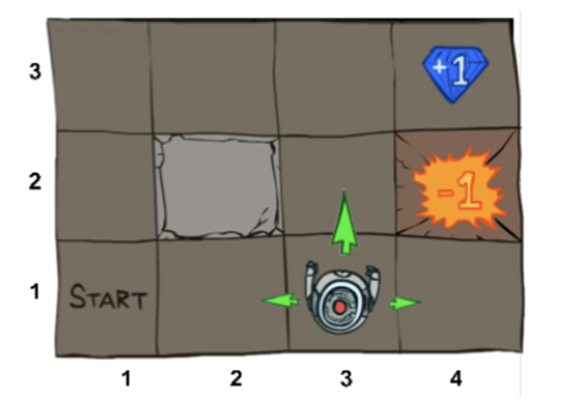
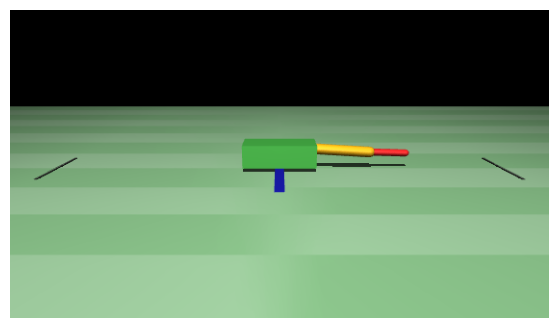

# CMM 2026 RL Lecture Demos

<p align="center">
  
  
</p>

This directory contains the lecture notebooks, figure-generation scripts, and crawler demos used for the 2026 "Computational Models of Motion" RL lectures.

The main runnable pieces are:

- `L6-0_demo_gridworld_dp.ipynb`: exact methods on gridworld
- `L6-1_demo_crawler_q-learning.ipynb`: value-based methods on the 2D MuJoCo crawler
- `L6-2_demo_crawler_pg.ipynb`: policy-gradient methods on the same crawler
- `teleop_crawler.py`: interactive crawler teleoperation demo
- `scripts/*.py`: one-off figure generators for lecture visuals

Notebook overview:

| Notebook | Algorithms covered | You learn |
|---|---|---|
| `L6-0_demo_gridworld_dp.ipynb` | **gridworld**: policy evaluation, value iteration, policy iteration, Q-value iteration, tabular Q-learning | value functions, Bellman backups, exact planning vs sample-based learning |
| `L6-1_demo_crawler_q-learning.ipynb` | **crawler2d**: value iteration, policy iteration, tabular Q-learning, DQN | model-based vs model-free control, state discretization limits, why function approximation helps |
| `L6-2_demo_crawler_pg.ipynb` | **crawler2d**: REINFORCE, REINFORCE with baseline, actor-critic | stochastic policies, continuous actions, likelihood-ratio gradient intuition, variance reduction |

## 1. Prerequisites

Recommended local setup:

- Python 3.10 or 3.11
- Ubuntu or macOS
- a working GUI environment if you want to run `teleop_crawler.py`

If you are on Windows, you can still try following the installation steps below. We have not tested this setup on Windows. If it does not work reliably, use the Colab or Docker setup instead.

Notes:

- `mujoco` is installed from PyPI; no separate MuJoCo download is required for this repo.
- `ffmpeg` is required if you want notebook cells that export animations or videos to work. Without it, Matplotlib video export fails with `RuntimeError: Requested MovieWriter (ffmpeg) not available`.
- `tkinter` is required for `teleop_crawler.py`. It is usually available on macOS system Python installations. If your Python build does not include it, the teleop script will not launch.
- `uv` works on macOS, Linux, and Windows, but this repo has only been tested locally on Ubuntu and macOS.
- This repo now includes a minimal `pyproject.toml` and `.python-version`, so `uv sync` can create and populate the environment directly from project metadata.
- On Linux, `pip install torch` may install a CUDA-enabled wheel. If you specifically want a CPU-only PyTorch build, use the selector on the official PyTorch install page instead of the default command below.
- On Windows, if local Python, MuJoCo, or GUI setup becomes painful, a Docker-based notebook workflow is a reasonable fallback.

Install `ffmpeg` before running notebooks that save videos:

Ubuntu:

```bash
sudo apt update
sudo apt install -y ffmpeg
```

macOS:

```bash
brew install ffmpeg
```

## 2. Create and configure the environment

### 2.1 Using `uv`

Recommended `uv` workflow from this directory:

```bash
python3 -m pip install --user uv
~/.local/bin/uv sync
```

If `uv` is on your `PATH`, you can replace `~/.local/bin/uv` with `uv`.

`uv sync` will create `.venv/`, resolve from `pyproject.toml`, and install the pinned dependencies into that environment.

With `uv`, you can also run notebook commands without manually activating first:

```bash
~/.local/bin/uv run jupyter lab
```

### 2.2 Using `.venv` directly

If you prefer not to use `uv`, the `virtualenv` workflow also works:

```bash
python3 -m pip install --user virtualenv
python3 -m virtualenv .venv
source .venv/bin/activate
python -m pip install --upgrade pip
python -m pip install \
  numpy \
  matplotlib \
  pillow \
  ipython \
  ipykernel \
  notebook \
  jupyterlab \
  ipywidgets \
  mujoco \
  gymnasium \
  torch \
  stable-baselines3
```

If your system already has `python3-venv` installed and you prefer the stdlib tool, this equivalent alternative also works:

```bash
python3 -m venv .venv
source .venv/bin/activate
python -m pip install --upgrade pip
python -m pip install \
  numpy \
  matplotlib \
  pillow \
  ipython \
  ipykernel \
  notebook \
  jupyterlab \
  ipywidgets \
  mujoco \
  gymnasium \
  torch \
  stable-baselines3
```

Verified locally in this repo on March 26, 2026 with Python `3.10.12`:

- `numpy 2.2.6`
- `matplotlib 3.10.8`
- `pillow 12.1.1`
- `ipython 8.38.0`
- `ipykernel 7.2.0`
- `notebook 7.5.5`
- `jupyterlab 4.5.6`
- `ipywidgets 8.1.8`
- `mujoco 3.6.0`
- `gymnasium 1.2.3`
- `torch 2.11.0+cu130`
- `stable-baselines3 2.7.1`

Register the environment as a Jupyter kernel:

```bash
.venv/bin/python -m ipykernel install --user --name rl-lectures --display-name "Python (rl-lectures)"
```

Quick verification:

```bash
.venv/bin/python -c "import mujoco, torch, gymnasium, stable_baselines3; print(mujoco.__version__, torch.__version__)"
```

### 2.3 Using Google Colab

If you do not want to install anything locally, the notebooks are written to be Colab-friendly.

Recommended Colab workflow:

1. Upload the notebook you want to run to Google Colab.
2. Run the cells from top to bottom.
3. Approve any notebook setup cells that install Python packages.

What works well in Colab:

- `L6-0_demo_gridworld_dp.ipynb`
- `L6-1_demo_crawler_q-learning.ipynb`
- `L6-2_demo_crawler_pg.ipynb`

Important Colab notes:

- the crawler notebooks already include setup cells such as `!pip install -q mujoco` for Colab compatibility
- the crawler environments are defined inline in the notebooks, so no separate package install from this README is usually needed beyond running the notebook cells
- notebook files saved in Colab stay in your Colab or Google Drive workflow unless you explicitly download them back into this repo
- `teleop_crawler.py` is not the intended workflow for Colab

### 2.4 Backup option for Windows: run notebooks in Docker

If you are on Windows and cannot get the local Python or MuJoCo setup working reliably, use Docker Desktop as a fallback for the notebooks.

What this fallback is good for:

- running `L6-0_demo_gridworld_dp.ipynb`
- running the crawler notebooks through Jupyter in a browser
- avoiding most host-side Python package issues

What it is **not** good for:

- `teleop_crawler.py` GUI usage
- tightly integrated desktop graphics workflows
- fastest possible training performance

Prerequisites:

- install Docker Desktop
- enable the WSL2 backend if Docker Desktop asks for it
- open a PowerShell window in this repo root

Start a Jupyter container with this repo mounted into `/workspace`:

```bash
docker run --rm -it -p 8888:8888 -v "${PWD}:/workspace" -w /workspace jupyter/scipy-notebook:python-3.11 bash
```

Inside the container, install the extra packages this repo needs:

```bash
pip install mujoco gymnasium torch stable-baselines3 ipywidgets
```

If you also want notebook video export inside the container, install `ffmpeg` there too:

```bash
apt-get update && apt-get install -y ffmpeg
```

Then start Jupyter inside the container:

```bash
jupyter notebook --ip=0.0.0.0 --port=8888 --no-browser --NotebookApp.token=''
```

Then open this URL in your browser on the Windows host:

```text
http://127.0.0.1:8888
```

Notes:

- this container is a fallback, not the primary supported workflow
- files you edit in the notebook are saved back to the mounted repo on the host
- if video export still fails in the container, skip the export cells first and debug `ffmpeg` second
- if you want a persistent image for repeated use, build your own Dockerfile later instead of reinstalling packages every time

## 3. Activate the environment in later sessions

Every time you come back to the repo:

```bash
cd /path/to/rl_lectures
source .venv/bin/activate
```

## 4. Run the notebooks

### 4.1 With `uv`

Start Jupyter without activating the environment:

```bash
~/.local/bin/uv run jupyter notebook
```

### 4.2 With an activated `.venv`

Start Jupyter after activation:

```bash
jupyter notebook
```

Open the notebooks in this order:

1. `L6-0_demo_gridworld_dp.ipynb`
2. `L6-1_demo_crawler_q-learning.ipynb`
3. `L6-2_demo_crawler_pg.ipynb`

Notebook notes:

- In each notebook, run cells from top to bottom.
- The crawler notebooks include `!pip install -q mujoco` in their setup cells for Colab compatibility. Locally, if your `.venv` is already configured, that cell is harmless but usually unnecessary.
- The crawler notebooks cache trained models in `saved_checkpoints/` and may reuse them automatically.
- If you want to force retraining, set `FORCE_RETRAIN = True` in the relevant notebook helper cell.
- `L6-2_demo_crawler_pg.ipynb` expects the Lecture 1 notebook artifacts to exist if you want to compare against saved Lecture 1 policies from `saved_policies/`.

## 5. Run the interactive crawler teleop demo

Continuous torque control:

```bash
.venv/bin/python teleop_crawler.py --mode continuous
```

Discrete 4-action control:

```bash
.venv/bin/python teleop_crawler.py --mode discrete
```

If you already activated the environment, the equivalent commands are:

```bash
python teleop_crawler.py --mode continuous
python teleop_crawler.py --mode discrete
```

## 6. Run the figure-generation scripts

These scripts regenerate lecture figures under `generated_figures/`.

Gridworld intro figure:

```bash
python scripts/generate_gridworld_intro_visual.py
```

Likelihood-ratio policy-gradient figures:

```bash
python scripts/generate_likelihood_ratio_visuals.py
```

Variance-reduction figures:

```bash
python scripts/generate_variance_reduction_visuals.py
```

## 7. Outputs and cached artifacts

Running the notebooks and scripts will read from or write to these directories:

- `generated_figures/`: regenerated static figures for slides and notebooks
- `saved_checkpoints/`: notebook training checkpoints
- `saved_rollouts/`: saved rollout videos/data

These folders are part of the workflow. Do not delete them unless you intentionally want to discard cached outputs.

## 8. Colab notes

See Section `2.3 Using Google Colab` for the actual Colab workflow.

For local work, use the `uv` or `.venv` instructions above instead of relying on per-notebook installs.

## 9. Troubleshooting

`ModuleNotFoundError`

- Make sure the `.venv` is activated.
- Make sure the notebook is using the `Python (rl-lectures)` kernel.

`teleop_crawler.py` opens no window or crashes on startup

- Check that `tkinter` is available in your Python build.
- Run the teleop script from a normal desktop session, not a headless shell.

`RuntimeError: Requested MovieWriter (ffmpeg) not available`

- Install the system `ffmpeg` package.
- On Ubuntu: `sudo apt install -y ffmpeg`
- On macOS: `brew install ffmpeg`

Matplotlib cache or font-cache warnings

- In restricted environments, set:

```bash
export MPLCONFIGDIR=/tmp/matplotlib
```

Notebook retrains instead of loading a checkpoint

- Check that `saved_checkpoints/` exists in this directory.
- Make sure you launched Jupyter from this repo root.
- Check whether `FORCE_RETRAIN` was set to `True`.

## 10. Minimal local workflow

If you just want the shortest path from clone to running notebooks:

```bash
cd /path/to/rl_lectures
python3 -m pip install --user uv
~/.local/bin/uv sync
~/.local/bin/uv run jupyter lab
```
